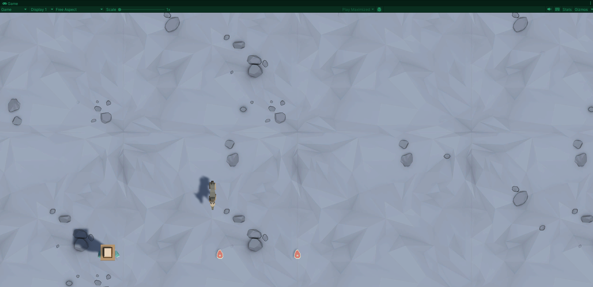
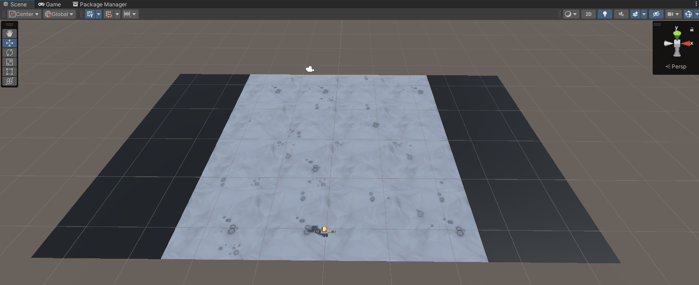

# 🐾 Unity Animal Attack – Beginner Gameplay Project

This Unity project is a beginner-friendly game prototype where the player defends against incoming animals. The player moves left and right using the arrow keys, shoots bullets with the **Space** key, and spawns animals using the **S** key. Throughout the game, animals descend from the top of the screen, and the player’s goal is to shoot them before they reach the bottom.

---

## 📸 Screenshots

### 🎮 Game View:

### 🛠️ Scene View:

---

## 🎮 Gameplay Summary

- 🧍 The player moves **left and right** using the arrow keys.
- 🚫 The player cannot move beyond the screen boundaries.
- 🔫 Pressing the **Space** key fires a projectile.
- 🐮 Pressing the **S** key spawns a random animal.
- 🧨 If the projectile collides with an animal, both are destroyed.
- 💀 If an animal passes the player, a “Game Over” message is displayed.

---

## 📦 Project Features

### 🧍 Player Controls
- Left / Right movement using arrow keys
- Movement is restricted within screen bounds (controlled via `if` and `else-if` logic)
- Uses `KeyCode.LeftArrow` and `KeyCode.RightArrow` for input

### 🔫 Bullet Mechanic
- Bullets are instantiated when the **Space** key is pressed
- Bullets are destroyed once they exit the screen (`Destroy()`)

### 🐷 Animal Spawning System
- Pressing the **S** key spawns a random animal
- Animal prefabs are stored in an array
- `Random.Range()` selects a random animal and spawn position
- The camera can be configured in **perspective** or **orthographic** mode

### ⏰ Auto Spawn + Collisions
- Animals spawn automatically at intervals using `InvokeRepeating()`
- Animals walk downward on the screen
- If animals reach the player, it triggers the Game Over sequence
- When bullets and animals collide, both are removed from the scene (`OnTriggerEnter()`)

---

## 🧠 Key Concepts Learned

| Concept                      | Description |
|------------------------------|-------------|
| **If / Else-if Statements**  | Handling player boundaries and input conditions |
| **Instantiate & Destroy**    | Creating and removing bullets and animals |
| **Key Presses**              | Using `Input.GetKeyDown()` and `KeyCode` |
| **Arrays**                   | Storing and managing multiple prefabs |
| **Local vs Global Variables**| Scope management for variables in functions |
| **Colliders / Triggers**     | Handling collisions between bullets and animals |
| **InvokeRepeating()**        | Timer-based automatic spawning |
| **Camera Projections**       | Understanding perspective vs orthographic views |

---

## 🗂️ Project Folder Structure
